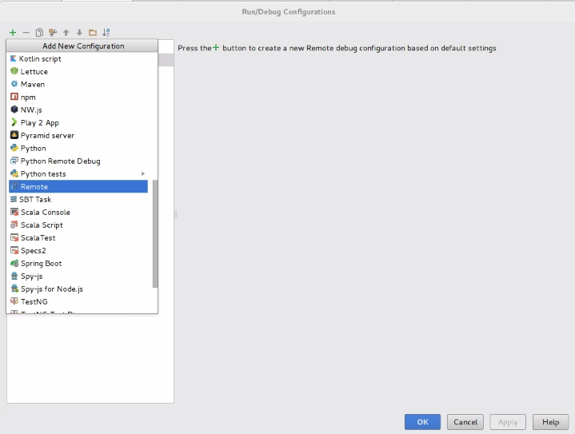
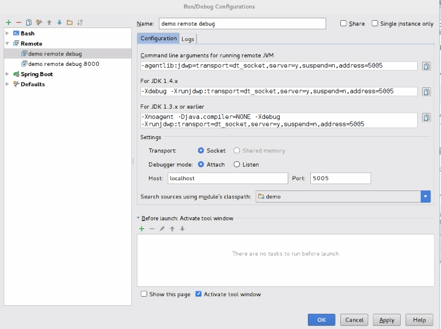

## purpose
This is a demo webapp made with spring boot that prints the host IP address.
It can be deployed on Openshift using the Fabric8 maven plugin.
The resource fragment strategy is used in this demo : https://maven.fabric8.io/#resource-fragments

Before starting this you may read the documentation or refer to the [confluence presentation](https://confluence.edelia.net/x/gwBp) 
- https://maven.fabric8.io
- https://spring.fabric8.io
- https://fabric8.io/gitbook/developer.html

## requirements
	- 8Go ram
	- run minishift v1.2.0 locally or openshift origin 1.5.1

## spring boot

### run
./mvnw spring-boot:run
open http://localhost:8080/
open http://localhost:8080/properties
open http://localhost:8080/env

### build
./mvnw clean package -DskipTests

### test
./mvnw test

## fabric8

### plugin
The fabric8-maven-plugin (f8-m-p) brings your Java applications on to Kubernetes and OpenShift. It provides a tight integration into Maven and benefits from the build configration already provided. This plugin focus on two tasks: 
	- Building Docker images
	- creating Kubernetes and OpenShift resource descriptors.

### install [NOT REQUIRED IN THIS DEMO]
If the fabric8 maven plugin is not already set in your project pom.xml, then add it to this awy :
```
./mvnw io.fabric8:fabric8-maven-plugin:3.3.5:setup
```

### use with Openshift

- First you need to connect to Openshift :
```
oc login https://openshift_host -u username -p password
```

- then create a new project :
```
oc new-project demo
```

- then you can deploy the demo (need to be built before) :
```
./mvnw fabric8:deploy
```

- you can also log the application :
```
./mvnw fabric8:log
```

- and test it into another namespace :
You can run some K8 tests. Those tests are made towards the demo pods. First a new demo pod is deployed in a new project onto Openshift and then the K8 are executed onto them.
```
./mvnw test -Dtest=*KT
```
You can have some warnings like "WARN io.fabric8.arquillian.utils.Namespaces - failed to update namespace: io.fabric8.kubernetes.client.KubernetesClientException: Failure executing: PATCH at: https://192.168.99.100:8443/api/v1/namespaces/itest-2b3cb934-ee9d-43f6-88a6-495bc4e5240d. Message: Forbidden! User developer/192-168-99-100:8443 doesn't have permission..". This is only a warning and should not make the test fail. If the test fails, you can test by adding your user the cluster-admin role :
```
oc adm policy add-cluster-role-to-user cluster-admin developer --as system:admin
```

- you can scale to more than one pod if you wish :
```
mvn fabric8:start -Dfabric8.replicas=2
```

- or debug it :
```
./mvnw fabric8:debug
```
This will use the default Java remote debugging port of 5005. You can specify a different port if you wish
```
mvn fabric8:debug -Dfabric8.debug.port=8000
```
Once that goal is running the debug port will be open on your laptop (localhost) which then connects using port forwarding to your most recent running pod for your app.
So you can now just start a Remote debug execution in your IDE (like you do to debug remote application server instances) and you can set breakpoints and debug your pod while its inside kubernetes.
e.g. in IntelliJ here’s how you add a Run/Debug execution:




At the end you can undeploy the application :
```
./mvnw fabric8:undeploy
``` 

## Hystrix

### circuit breakers
Hystrix has been added to this sample to show how to use it with spring boot and Openshift/Fabric8
Two services use it :
	- http://localhost:8080/
	- http://localhost:8080/hystri-external-service that call the spring-boot-webmvc service

### Hystrix Dashboard
A Hystrix dashboard has also been added to check the hystrix streams.
You need to go to http://localhost:8080/hystrix use http://localhost:8080/hystrix.stream as stream.
Then click to "monitor stream"

To see circuit breaking in action, launch multiple times the REST call http://localhost:8080/external-service
You'll then see in the dashboard that the corresponding service pass from "close" state to "open" state to avoid bypass call.
